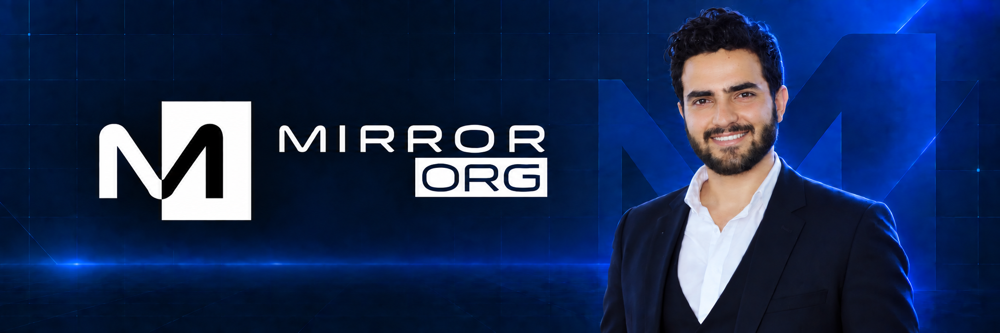

  

<h1 align="center">Mohamed Ashraf</h1>

<strong>Founder &amp; Lead Software Engineer at <a href="https://mirrororg.com/">MirrorORG</a></strong>

SaaS Architect · Full-Stack Engineer · Product &amp; Automation Builder

I build and operate digital products that turn complex business ideas into fast, reliable, and scalable experiences.

  
  
  
  

---

## Executive Profile

I am a software engineer, product builder, and technology founder from Egypt with **15+ years of experience** delivering production-grade websites, SaaS platforms, e-commerce systems, integrations, and digital infrastructure.

As Founder and Lead Software Engineer at **[MirrorORG](https://mirrororg.com/)**, I lead the complete product journey — from discovery, strategy, architecture, and UI/UX to full-stack development, deployment, monitoring, optimization, and long-term growth. My focus is not simply shipping features; it is building systems that are clear for users, dependable for teams, and valuable for the business.

I currently lead the product ecosystems behind **Mersal**, **Masar**, and **Bosta**, while overseeing client work across commerce, education, healthcare, travel, professional services, and digital publishing.

> Product thinking. Strong engineering. Reliable delivery. Measurable results.

## What I Build

| | Service | Delivery Focus |
| :---: | :--- | :--- |
| 🌐 | **Web & SaaS Engineering** | Custom platforms, business portals, dashboards, multilingual experiences and scalable product architecture. |
| 🛒 | **E-Commerce Systems** | WooCommerce stores, product discovery, checkout, payment integrations, shipping and conversion-focused UX. |
| ⚙️ | **Automation & Integrations** | APIs, webhooks, messaging workflows, AI integrations and connected business operations. |
| ⚡ | **Performance & SEO** | Core Web Vitals, caching, CDN strategy, technical SEO and high-performance delivery. |
| 🎨 | **Product Design & Branding** | UI/UX, visual direction, design systems, brand identity and responsive interface design. |
| 🛡️ | **Reliability & Support** | Monitoring, backups, security hardening, maintenance and ongoing technical support. |

  

## Products I Lead

| Product | Business Value | Key Capabilities |
| :--- | :--- | :--- |
| **[Mersal — مرسال](https://mersal.it/)** | Omnichannel communication and intelligent marketing automation. | WhatsApp, SMS, email, Telegram, unified inbox, AI replies, campaigns, WooCommerce, APIs and webhooks. |
| **[Masar — مسار](https://msar.cloud/)** | AI-powered web studio for fast bilingual website delivery. | AI art direction, Arabic/English generation, live editing, motion, SEO, analytics, automation and self-hosting. |
| **[Bosta — بوسطة](https://bosta.email/)** | Secure professional email infrastructure for custom domains. | Business mailboxes, DNS setup, SPF/DKIM/DMARC, anti-spam, webmail, IMAP/SMTP and encrypted delivery. |

## MirrorORG in Numbers

| **98+** Projects | **52** Websites | **20** Social Campaigns | **12** Brand Identities | **14** Performance Projects |
| :---: | :---: | :---: | :---: | :---: |
| Since 2010 | WordPress & WooCommerce | Creative Campaigns | Visual Systems | PageSpeed & GTmetrix |

## Selected Client Work

<table>
  <tr>
    <td width="50%" align="center">
       
      <strong><a href="https://masterroom.com/">Master Room</a></strong> 
      Saudi furniture e-commerce, payments, offers and order journeys.
    </td>
    <td width="50%" align="center">
       
      <strong><a href="https://new.medimixegypt.com/">MediMix Egypt</a></strong> 
      Product discovery, filters, checkout, delivery and flash sales.
    </td>
  </tr>
  <tr>
    <td width="50%" align="center">
       
      <strong><a href="https://iv-radiology.com/">IV Radiology</a></strong> 
      Specialized medical education and professional training platform.
    </td>
    <td width="50%" align="center">
       
      <strong><a href="https://pcv-ae.com/">Prime Care Veterinary Clinic</a></strong> 
      Bilingual healthcare experience with clear service journeys.
    </td>
  </tr>
  <tr>
    <td width="50%" align="center">
       
      <strong><a href="https://pure-tour.com/">Pure Tour</a></strong> 
      Premium travel platform focused on curated Maldives experiences.
    </td>
    <td width="50%" align="center">
       
      <strong><a href="https://riwaqtype.com/">RiwaqType</a></strong> 
      Professional marketplace for typefaces and creative assets.
    </td>
  </tr>
</table>

<strong><a href="https://projects.mirrororg.com/">Explore the complete MirrorORG portfolio — 98+ real projects →</a></strong>

## Performance & Reliability Engineering

Performance is treated as a product feature, not a final checklist. MirrorORG work includes front-end optimization, image strategy, caching, database tuning, CDN delivery, Core Web Vitals, uptime monitoring, backups, and security hardening.

<table>
  <tr>
    <td width="33%" align="center"> <strong>Mobile PageSpeed</strong> Green-zone performance.</td>
    <td width="33%" align="center"> <strong>Desktop PageSpeed</strong> 90–100 target range.</td>
    <td width="33%" align="center"> <strong>GTmetrix Optimization</strong> 100% result, 2.2s load.</td>
  </tr>
</table>

| Performance | Reliability | Growth |
| :--- | :--- | :--- |
| Core Web Vitals, caching, CDN, code and database optimization | 99.9% uptime monitoring, 5-minute checks, backups and security updates | Technical SEO, analytics, UX improvements and conversion-focused delivery |

## Open Source

Production-minded tools I've open-sourced, each drawn from a MirrorORG product. Every repo is fully tested and runs CI on every push.

| Project | Stack | What it does |
| :--- | :--- | :--- |
| **[mailguard](https://github.com/mashraf1997/mailguard)** | `Go` | Audits a domain's SPF, DKIM, DMARC, MX, MTA-STS and TLS-RPT records, grades it A–F, and gives step-by-step fixes. Built on lessons from **Bosta**. |
| **[arabic-kit](https://github.com/mashraf1997/arabic-kit)** | `TypeScript` | Arabic toolkit: spelling-tolerant search, normalization, slugs, transliteration, digits, direction and تفقيط (number-to-words) for invoices. Powers bilingual work like **Masar**. |
| **[hookshield](https://github.com/mashraf1997/hookshield)** | `PHP` | Standard Webhooks signing/verification with key rotation, replay protection and retrying delivery. Born from **Mersal**'s event pipeline. |
| **[bundle-budget](https://github.com/mashraf1997/bundle-budget)** | `Node.js` | Performance budgets for build output (raw, gzip, brotli) with baselines, Markdown PR reports and CI exit codes. The guardrail behind our 95%+ PageSpeed focus. |

## Core Engineering Stack

**Backend** — <code>PHP</code> · <code>Laravel</code> · <code>Node.js</code> · <code>Go</code> · <code>MySQL</code> · <code>REST APIs</code> · <code>Webhooks</code>  
**Frontend** — <code>JavaScript</code> · <code>TypeScript</code> · <code>Next.js</code> · <code>HTML5</code> · <code>CSS3</code>  
**Platforms** — <code>WordPress</code> · <code>WooCommerce</code> · <code>Linux</code> · <code>Git</code> · <code>Cloudflare</code>  
**Product Systems** — <code>AI Integrations</code> · <code>Automation</code> · <code>Email Infrastructure</code> · <code>Omnichannel Messaging</code>

## Let’s Build Something Valuable

I work best on ambitious products where engineering quality, thoughtful design, reliable infrastructure, and business outcomes all matter.

  <a href="https://projects.mirrororg.com/"><strong>View Our Work</strong></a> ·
  <a href="https://mirrororg.com/"><strong>Visit MirrorORG</strong></a> ·
  <a href="mailto:info@mirrororg.com"><strong>Start a Conversation</strong></a>

